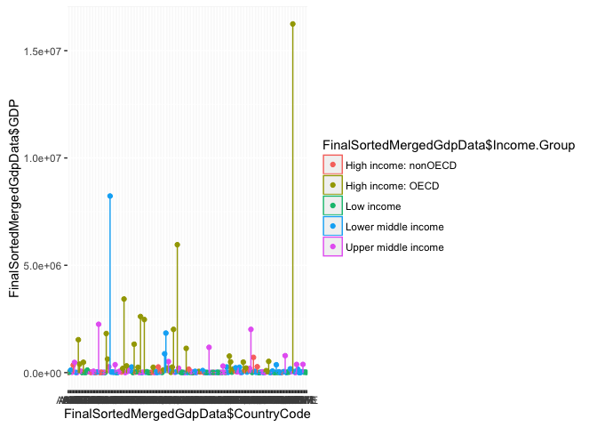

# Case Study for Unit 6
Rajeev  
June 15, 2016  
#Introduction
The objective of this project is to gather, cleanse and analyze the GDP data across countries. It also aims to discover the GDP contribution of the countries of the different income groups. 
Moreover, we also want to determine the total number of the lower income countries which are in the group of the highest GDP.

#Download GDP and Educational Source Data Raw Files 


```r
# Set Working Directory
setwd("/Users/rajeevkumar/Documents/R-Studio/CaseStudy6")
sitegdp="https://d396qusza40orc.cloudfront.net/getdata%2Fdata%2FGDP.csv"
#Download GDP File from web to local
download.file(sitegdp, destfile = "./getdata%2Fdata%2FGDP.csv", method="curl")
siteed="https://d396qusza40orc.cloudfront.net/getdata%2Fdata%2FEDSTATS_Country.csv"
#Download Education Data File from web to local
download.file(siteed, destfile = "./getdata%2Fdata%2FEDSTATS_Country.csv", method="curl")
```

#Read and Clean Downloaded GDP Data into R

```r
#Read GDP csv file into R. skip first 5 rows and read 231 rows
GdpRawData<-read.csv("./getdata%2Fdata%2FGDP.csv",sep=",",header = FALSE,skip = 5,nrows = 231)

# Read only column 1,2,4 and 5 : Subset of Data
GdpData<-GdpRawData[c(1,2,4,5)]

# Add column name to each variables : Labelling each column.
names(GdpData)<-c("CountryCode","Ranking","Country","GDP")

#Remove "," From GDP : Data Cleansing
GdpData$GDP<-gsub(",","",GdpData$GDP)

#Count Number of NA in all fields
sapply(GdpData, function(x) sum(is.na(x)))
```

```
## CountryCode     Ranking     Country         GDP 
##           0          41           0           0
```

```r
# Keep only those whose Ranking is available : Data Cleansing
GdpData<-subset(x=GdpData,!is.na(GdpData$Ranking))

#Convert Factor to Charachter : Data Type Conversion
GdpData$CountryCode<-as.character(GdpData$CountryCode)
GdpData$Country<-as.character(GdpData$Country)

#Convert GDP to Number : Data Type Conversion
GdpData$GDP<-as.numeric(GdpData$GDP)
```

#Read and Clean Downloaded Education Data into R

```r
EducRawData<-read.csv("./getdata%2Fdata%2FEDSTATS_Country.csv",sep=",",header = TRUE)

#Count Number of NA in all fields
sapply(EducRawData, function(x) sum(is.na(x)))
```

```
##                                       CountryCode 
##                                                 0 
##                                         Long.Name 
##                                                 0 
##                                      Income.Group 
##                                                 0 
##                                            Region 
##                                                 0 
##                                  Lending.category 
##                                                 0 
##                                      Other.groups 
##                                                 0 
##                                     Currency.Unit 
##                                                 0 
##                          Latest.population.census 
##                                                 0 
##                           Latest.household.survey 
##                                                 0 
##                                     Special.Notes 
##                                                 0 
##                       National.accounts.base.year 
##                                                 0 
##                  National.accounts.reference.year 
##                                               197 
##                       System.of.National.Accounts 
##                                               149 
##                               SNA.price.valuation 
##                                                 0 
##                     Alternative.conversion.factor 
##                                                 0 
##                                   PPP.survey.year 
##                                                89 
##                 Balance.of.Payments.Manual.in.use 
##                                                 0 
##                    External.debt.Reporting.status 
##                                                 0 
##                                   System.of.trade 
##                                                 0 
##                     Government.Accounting.concept 
##                                                 0 
##                   IMF.data.dissemination.standard 
##                                                 0 
## Source.of.most.recent.Income.and.expenditure.data 
##                                                 0 
##                       Vital.registration.complete 
##                                                 0 
##                        Latest.agricultural.census 
##                                                 0 
##                            Latest.industrial.data 
##                                               139 
##                                 Latest.trade.data 
##                                                46 
##                      Latest.water.withdrawal.data 
##                                                82 
##                                     X2.alpha.code 
##                                                 1 
##                                         WB.2.code 
##                                                 1 
##                                        Table.Name 
##                                                 0 
##                                        Short.Name 
##                                                 0
```

#Merge Data of 2 datasets on Country Code Column

```r
MergedGdpData<-merge(GdpData,EducRawData,by="CountryCode",all =TRUE)
```

#Q1:- Match the data based on the country shortcode. How many of the IDs match? 

```r
sum(!is.na(unique(MergedGdpData$Ranking)))
```

```
## [1] 189
```

#Q2:-Sort the data frame in ascending order by GDP  (so United States is last). What is the 13th country in the resulting data frame?

```r
SortedMergedGdpData <- MergedGdpData[order(MergedGdpData$GDP,decreasing = FALSE),]
SortedMergedGdpData$Country[13]
```

```
## [1] "St. Kitts and Nevis"
```

#Q3:- What are the average GDP rankings for the "High income: OECD" and "High income: nonOECD" groups? 
#For "High income: OECD"

```r
#Remove Na from the dataset
FinalSortedMergedGdpData<-SortedMergedGdpData[which(!(is.na(SortedMergedGdpData$Ranking) | is.na(SortedMergedGdpData$Income.Group))),]
mean(FinalSortedMergedGdpData$Ranking[which(FinalSortedMergedGdpData$Income.Group=="High income: OECD")])
```

```
## [1] 32.96667
```

#For "High income: nonOECD"

```r
mean(FinalSortedMergedGdpData$Ranking[which(FinalSortedMergedGdpData$Income.Group=="High income: nonOECD" )])
```

```
## [1] 91.91304
```
#Q4:- Plot the GDP for all of the countries. Use ggplot2 to color your plot by Income Group.


```r
library(ggplot2)
p <- ggplot(FinalSortedMergedGdpData, aes(x =FinalSortedMergedGdpData$CountryCode , y =FinalSortedMergedGdpData$GDP ,color=FinalSortedMergedGdpData$Income.Group)) + 
 geom_point() +  geom_density()
p
```

<!-- -->

```r
summary(FinalSortedMergedGdpData$Income.Group)
```

```
##                      High income: nonOECD    High income: OECD 
##                    0                   23                   30 
##           Low income  Lower middle income  Upper middle income 
##                   37                   54                   45
```


#Q5:- Cut the GDP ranking into 5 separate quantile groups. Make a table versus Income.Group. How many countries are Lower middle income but among the 38 nations with highest GDP?


```r
breaks <-quantile(SortedMergedGdpData$Ranking, probs=seq(0, 1, 0.2),na.rm=TRUE)

SortedMergedGdpData$QuantileRanking <- cut(SortedMergedGdpData$Ranking,breaks=breaks,labels=c("high", "medium high", "medium","medium low", "low"),include.lowest=TRUE)

sum(SortedMergedGdpData$Income.Group == "Lower middle income" & SortedMergedGdpData$QuantileRanking =="high" & !is.na(SortedMergedGdpData$QuantileRanking))
```

```
## [1] 5
```


